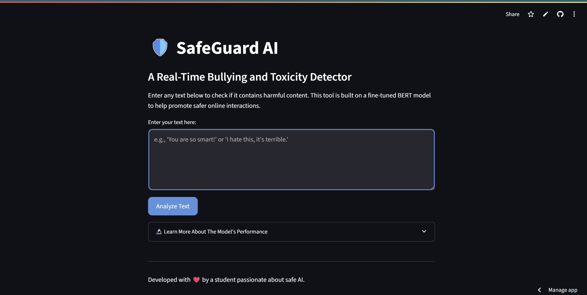

# 🛡️ Toxic Comment & Cyberbullying Classifier

A machine learning project designed to detect and classify toxic comments and instances of cyberbullying in text data. This model helps in creating safer online environments by identifying harmful content.



---

## 📜 Overview

This repository contains the code and resources for building a text classification model using Python and Scikit-learn. The model is trained to distinguish between toxic/bullying comments and non-toxic comments. It effectively handles the common problem of class imbalance in such datasets by using the **SMOTE** technique, ensuring it can identify the rare but important toxic examples.

---

## ✨ Key Features

* **Text Classification**: Classifies input text into 'Toxic' or 'Non-Toxic' categories.
* **TF-IDF Vectorization**: Converts text into a meaningful numerical format for the model.
* **Class Imbalance Handling**: Uses **SMOTE** (Synthetic Minority Over-sampling Technique) to create a balanced training dataset, leading to a more robust model.
* **Pre-trained Model**: Comes with a saved, ready-to-use model (`final_model.joblib`) and its corresponding vectorizer.

---

## 🛠️ Tech Stack

* **Python**
* **Scikit-learn**: For machine learning models and metrics.
* **Pandas**: For data manipulation.
* **Imblearn**: For handling imbalanced datasets with SMOTE.
* **Joblib**: For saving and loading the trained model.

---

## 🚀 Getting Started

Follow these instructions to get a copy of the project up and running on your local machine.

### Prerequisites

You need to have Python 3 installed on your system.

### Installation

1.  **Clone the repository:**
    ```sh
    git clone [https://github.com/your-username/your-repository-name.git](https://github.com/your-username/your-repository-name.git)
    cd your-repository-name
    ```

2.  **Create a virtual environment (recommended):**
    ```sh
    python -m venv venv
    source venv/bin/activate  # On Windows, use `venv\Scripts\activate`
    ```

3.  **Install the required packages:**
    ```sh
    pip install -r requirements.txt
    ```

---

##  usage

Here’s a simple example of how to load the model and make predictions on new sentences. Create a Python file (e.g., `predict.py`) and add the following code:

```python
import joblib

# Load the saved model and vectorizer
loaded_model = joblib.load('final_model.joblib')
loaded_vectorizer = joblib.load('tfidf_vectorizer.joblib')

print("✅ Model and vectorizer loaded successfully.")

# Prepare new sentences to classify
new_sentences = [
    "you are a wonderful and kind person",
    "this is the worst, most frustrating experience ever",
    "I hate you and everything you stand for"
]

# Transform the text using the loaded vectorizer
new_sentences_tfidf = loaded_vectorizer.transform(new_sentences)

# Make predictions
predictions = loaded_model.predict(new_sentences_tfidf)

# Print the results
print("\n--- Predictions ---")
for sentence, prediction in zip(new_sentences, predictions):
    result = "Toxic" if prediction == 1 else "Not Toxic"
    print(f"Sentence: '{sentence}'")
    print(f"Predicted: {result}\n")
```

---

## 🤝 Contributing

Contributions are what make the open-source community such an amazing place to learn, inspire, and create. Any contributions you make are **greatly appreciated**.

1.  Fork the Project
2.  Create your Feature Branch (`git checkout -b feature/AmazingFeature`)
3.  Commit your Changes (`git commit -m 'Add some AmazingFeature'`)
4.  Push to the Branch (`git push origin feature/AmazingFeature`)
5.  Open a Pull Request

---

## 📄 License

This project is distributed under the MIT License. See `LICENSE` for more information.

---
